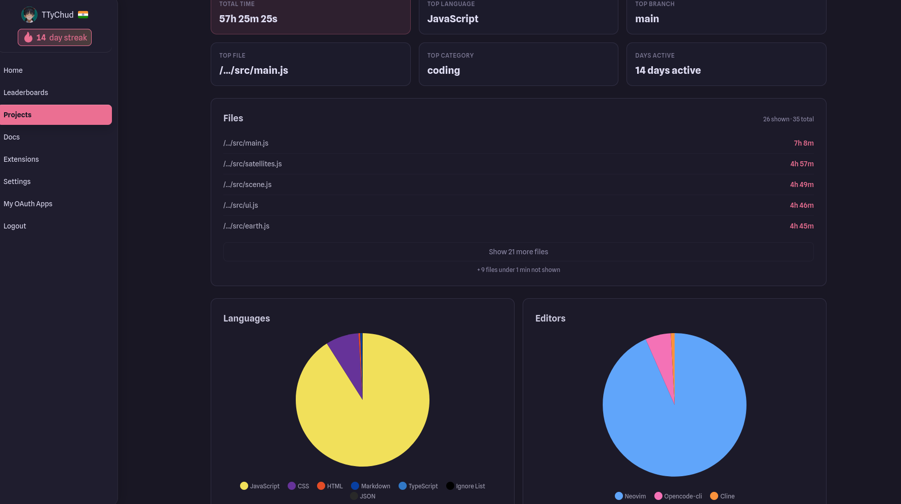

# Note to the reviewer
What do u mean write code by hand do u even know how many time i had refactor the codebase
and u expect it to look like shit
atleast look at the time i have invested 

can u explain if i had written it by hand how it endup 50+ hours if u want me to show u my hackatime wait why do i just show you



# Orbital

Orbital is a real-time 3D satellite tracking website built using vanilla JavaScript and Three.js. It tracks over 16,000 live space objects around earth using real-time data from CelesTrak.

## Overview of Features

* **Smooth Performance:** This website uses `THREE.InstancedMesh` to render 16,000+ objects smoothly without crashing the browser.

* **Accuracy:** Calculates exact satellite positions, velocities, and altitudes using `satellite.js` and TLE data. The calculations and the tracking data have been verified with other trusted sources like the official NASA satellite tracker.

* **Ground Tracking:** Includes an interactive 2D map that displays an object's past and future orbit tracks.

* **Space Object Search:** You can instantly search and filter through 16,000+ active satellites.

* **Filtering:** You can filter specific satellite groups instantly, including but not limited to categories like Starlink, OneWeb, GPS, Weather, and Space Stations.

* **API Caching:** This website stores the satellite data for 6 hours in the browser's local cache (`localStorage`) to mitigate API failures and rate limits.

* **Responsive UI:** A dark-themed UI that is optimized for both desktop and mobile devices.

## Tech Stack

* **Graphics:** Three.js (WebGL)
* **Physics/Math:** satellite.js (SGP4/SDP4 propagation)
* **3D Asset Loading:** `GLTFLoader` with `DRACOLoader` compression
* **Data Source:** [CelesTrak API](https://celestrak.org/)
* **Frontend:** Vanilla HTML5, CSS3, ES6 JavaScript (No frameworks)

## Run locally

```bash
npm install
npm run dev
```

Then open http://localhost:5173

Earth textures from [Solar System Scope](https://www.solarsystemscope.com/textures/) (CC BY 4.0).

## A few implementation notes

* Positions are propagated with SGP4 in the ECI frame, then rotated by GMST into a fixed three.js scene (y-up, earth at the origin). One scene unit = 6371 km.
* Orbit paths and the 2D ground track are frozen at the GMST of the moment you lock a target, so the path stays rigid relative to the satellite instead of smearing as the earth rotates underneath it.
* Propagating 16,000+ satellites every frame is too expensive, so the constellation loop updates a few thousand instances per frame and wraps around.
* TLE data is cached in localStorage for 6 hours. After that the app serves stale data for up to 7 days while it refreshes in the background, and falls back to a bundled TLE file if the network is completely unavailable.
* Camera flights slerp between the start and end directions (with a small nudge when they're antipodal) and add a bit of arc to the radius so the camera swings around the planet instead of clipping through it.
